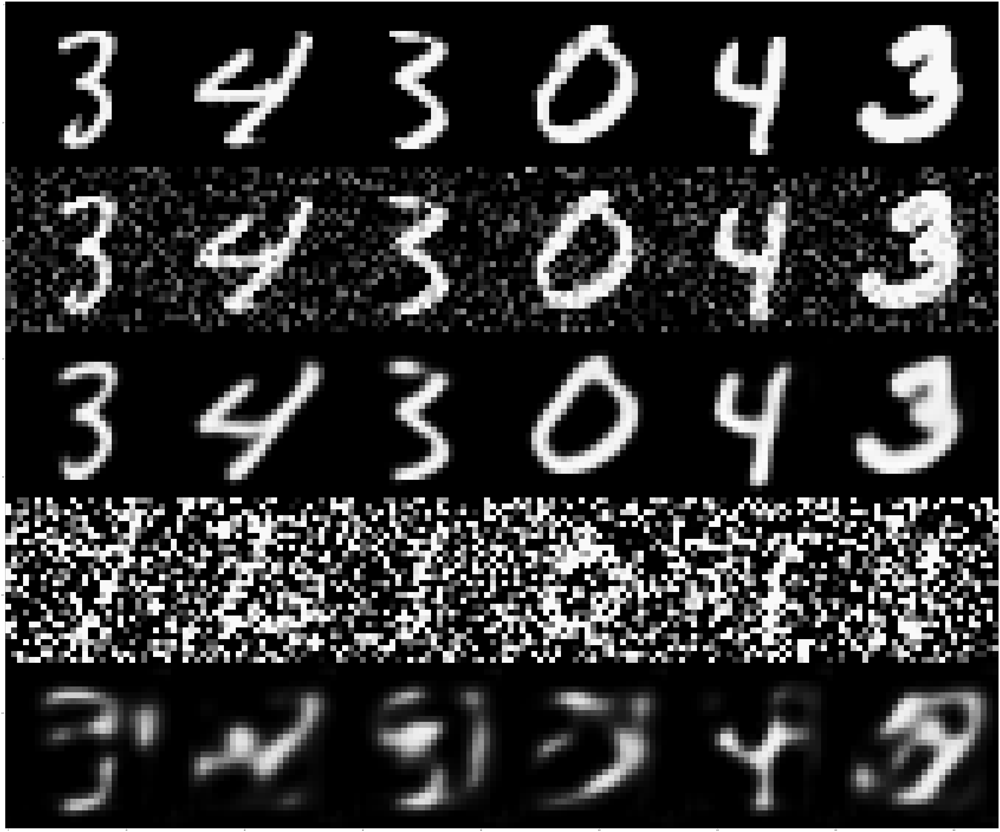

# Denoise-VAE
Deep convolutional autoencoder and autoencoder.  
Denoise-ae.ipynb use keras with tensorflow backend.  

# Results


First row: original images  
Second row: images add Gaussian noise with 0.2 as stddev  
Third row: Results with second row as inputs  
Forth row: images add Gaussian noise with 0.9 as stddev  
Fifth row: Results with forth row as inputs  
# Usage
```
git clone https://github.com/block98k/keras-ae.git
cd ./keras-ae
jupyter notebook keras-ae.ipynb
```

# Prerequisites
**tensorflow** 1.0 or above  
**numpy**  
**scipy**  
**jupyter**  
# Acknowledgement
This project is a homework of deeplearing course of Shenlan College
