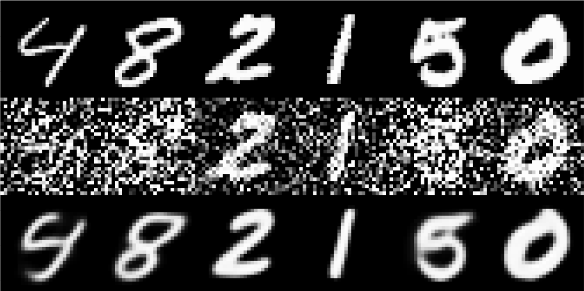

# Denoise-AE
Deep convolutional autoencoder.  
Use keras with tensorflow backend.  
This project is a homework of deeplearing course of Shenlan College.  
# Results


First row: original images  
Second row: images add Gaussian noise with random stddev  
Third row: results with second row as inputs  
# Usage
```
git clone https://github.com/block98k/keras-ae.git
cd ./keras-ae
jupyter notebook keras-ae.ipynb
```

# Prerequisites
**tensorflow** 1.0 or above  
**numpy**  
**scipy**  
**jupyter**  

